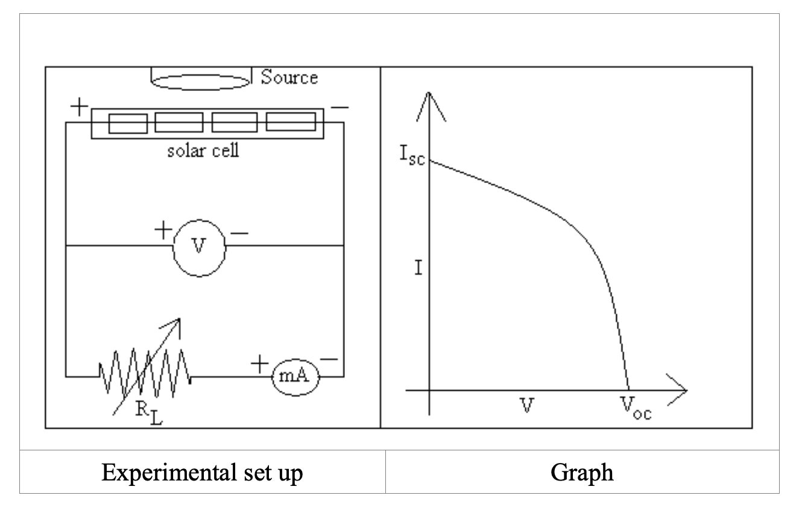

<h3>Procedure</h3>

<ol>
   <li>Keep the solar cell in front of source of light ‘S’ at some distance (15-20 cm) where experimental range readings are possible.</li>
   <li>Complete the circuit connections as shown in experimental set up.</li>
   <li>Find out the open circuit voltage VOC by opening the connecting wire joining negative of the milli-ammeter to the load i.e. connecting positive of solar cell to the positive of the voltmeter and negative of solar cell to the negative of voltmeter.</li>
   <li>Once again complete the circuit connections as shown in experimental set up</li>
   <li>Bring the load selector switch at S.C. position and note the reading in the ampere meter under short circuit condition. This maximum current is called short circuit current. ISC</li>
   <li>Vary the resistance from low value to higher values and note down corresponding current and voltage reading.</li>
   <li>Draw the graph between V and I.</li>
</ol> 

<h3>Observation Table</h3>

<table>
   <thead>
      <tr>
         <th style="border: 1px solid black; text-align: center; padding: 5px;">Trial No.</th>
         <th style="border: 1px solid black; text-align: center; padding: 5px;">Resistance (Ohm)</th>
         <th style="border: 1px solid black; text-align: center; padding: 5px;">Current (microAmp)</th>
         <th style="border: 1px solid black; text-align: center; padding: 5px;">Voltage (microVolts)</th>
      </tr>
   </thead>
   <tbody>
      <tr>
         <td style="border: 1px solid black; text-align: center; padding: 5px;">1</td>
         <td style="border: 1px solid black; text-align: center; padding: 5px;"></td>
         <td style="border: 1px solid black; text-align: center; padding: 5px;"></td>
         <td style="border: 1px solid black; text-align: center; padding: 5px;"></td>
      </tr>
      <tr>
         <td style="border: 1px solid black; text-align: center; padding: 5px;">2</td>
         <td style="border: 1px solid black; text-align: center; padding: 5px;"></td>
         <td style="border: 1px solid black; text-align: center; padding: 5px;"></td>
         <td style="border: 1px solid black; text-align: center; padding: 5px;"></td>
      </tr>
      <tr>
         <td style="border: 1px solid black; text-align: center; padding: 5px;">3</td>
         <td style="border: 1px solid black; text-align: center; padding: 5px;"></td>
         <td style="border: 1px solid black; text-align: center; padding: 5px;"></td>
         <td style="border: 1px solid black; text-align: center; padding: 5px;"></td>
      </tr>
      <tr>
         <td style="border: 1px solid black; text-align: center; padding: 5px;">4</td>
         <td style="border: 1px solid black; text-align: center; padding: 5px;"></td>
         <td style="border: 1px solid black; text-align: center; padding: 5px;"></td>
         <td style="border: 1px solid black; text-align: center; padding: 5px;"></td>
      </tr>
      <tr>
         <td style="border: 1px solid black; text-align: center; padding: 5px;">5</td>
         <td style="border: 1px solid black; text-align: center; padding: 5px;"></td>
         <td style="border: 1px solid black; text-align: center; padding: 5px;"></td>
         <td style="border: 1px solid black; text-align: center; padding: 5px;"></td>
      </tr>
      <tr>
         <td style="border: 1px solid black; text-align: center; padding: 5px;">6</td>
         <td style="border: 1px solid black; text-align: center; padding: 5px;"></td>
         <td style="border: 1px solid black; text-align: center; padding: 5px;"></td>
         <td style="border: 1px solid black; text-align: center; padding: 5px;"></td>
      </tr>
      <tr>
         <td style="border: 1px solid black; text-align: center; padding: 5px;">7</td>
         <td style="border: 1px solid black; text-align: center; padding: 5px;"></td>
         <td style="border: 1px solid black; text-align: center; padding: 5px;"></td>
         <td style="border: 1px solid black; text-align: center; padding: 5px;"></td>
      </tr>
      <tr>
         <td style="border: 1px solid black; text-align: center; padding: 5px;">8</td>
         <td style="border: 1px solid black; text-align: center; padding: 5px;"></td>
         <td style="border: 1px solid black; text-align: center; padding: 5px;"></td>
         <td style="border: 1px solid black; text-align: center; padding: 5px;"></td>
      </tr>
      <tr>
         <td style="border: 1px solid black; text-align: center; padding: 5px;">9</td>
         <td style="border: 1px solid black; text-align: center; padding: 5px;"></td>
         <td style="border: 1px solid black; text-align: center; padding: 5px;"></td>
         <td style="border: 1px solid black; text-align: center; padding: 5px;"></td>
      </tr>
      <tr>
         <td style="border: 1px solid black; text-align: center; padding: 5px;">10</td>
         <td style="border: 1px solid black; text-align: center; padding: 5px;"></td>
         <td style="border: 1px solid black; text-align: center; padding: 5px;"></td>
         <td style="border: 1px solid black; text-align: center; padding: 5px;"></td>
      </tr>
   </tbody>
</table>

<h3>Experimental Set up Diagram and Graph</h3>

<h3>Result</h3>

The characteristics of solar cell i.e. current voltage curve is studied it is found that voltage drops as current increases. 
Current and voltage found to depend on intensity of source and resistance. 

The values of solar cell parameters are, 
 

 Voc (Open circuit voltage) = __________ mV.
 

Isc  (short circuit current) =___________ μA.
 

