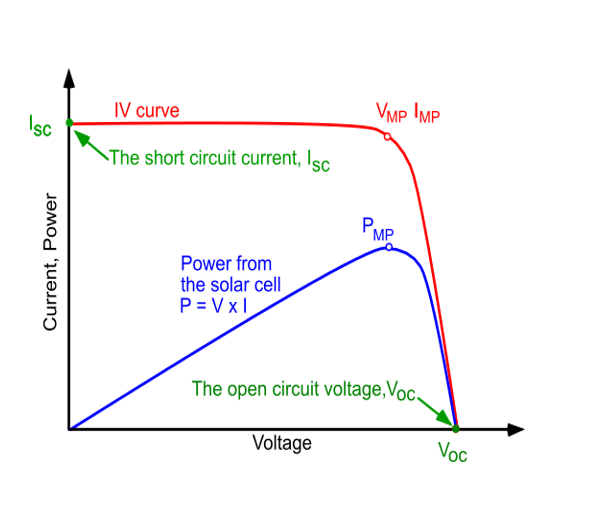
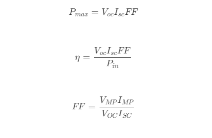

##Apparatus

Solar cell, source of light, voltmeter, ammeter, variable resistance.

##Theory

A solar cell (or a "photovoltaic" cell) is a device that converts photons from the sun (solar light) into electricity. It is a device which is made of p-n junction diode.

It was observed that when solar rays fall on a thin wafer of selenium, electricity is generated. A solar cell made of selenium converts only 0.7% of solar energy into electrical energy which is very small output and hence cannot be used for generating electricity. The first solar cell made in 1954 could convert about 1% of incident solar energy into electricity.

Modern solar cells most commonly made from semimetal silicon can have efficiency of upto 25%. Silicon is easily available and is eco-friendly. A typical solar cell consisting of a 2 x 2 cm square piece of pure silicon can produce about 0.7 watt electricity with about 10% efficiency. This electricity is quite small and to get large amount of electricity several solar cells are connected together in series. This arrangement is called Solar Panel.

Working: When light falls on the p-n junction, electron is excited to the valance band if the light energy is higher than the band gap energy. This generates the electron and holes which are equal in number in the valance and conduction band respectively. These electron hole pairs move in opposite directions to the barrier field. Electrons move towards the n-side and the hole is moved towards the p-side. So a voltage is set up which is known as photo voltage and when a load is connected, the current flows.

The materials which are used for this purpose must have band gap close to 1.5ev. Commonly used materials are- Silicon, GaAs, CuInSe2. The criteria for Materials to be Used in Solar Cell is the material must have band gap from 1ev to 1.8ev, it must have high optical absorption and it must have high electrical conductivity.

##Diagram

The efficiency of a solar cell is determined as the fraction of incident power which is converted to electricity and is defined as:

where,
&emsp;&emsp;&emsp; Voc is the open-circuit voltage,
&emsp;&emsp;&emsp; Isc is the short-circuit current,
&emsp;&emsp;&emsp; FF is the fill factor,
&emsp;&emsp;&emsp; η is the efficiency.

